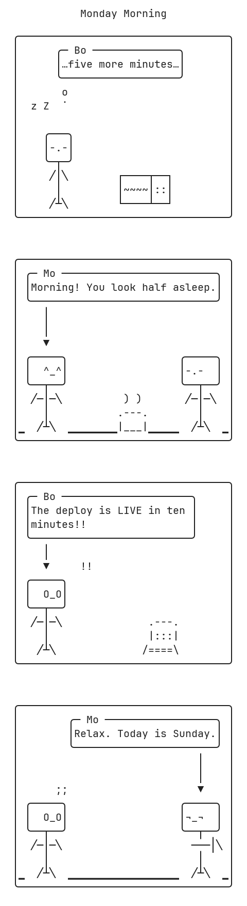

# comic-svg

Text-only comic generator on **Bun**: the LLM writes semantic JSON (component ids, cell
coordinates, dialogue text), a deterministic harness draws the raw ASCII cell grid, validates
it, and rasterizes it to **PNG/JPEG** with a pinned font.

## Pipeline (v0.3 — ASCII intermediate, raster output)

```
LLM → semantic JSON (component ids, cell coords, dialogue text)
    → compose.ts (bun)   draws the raw ASCII cell grid (borders, bubbles, chibis, props)
    → validate-grid.py   checks it in cell space (visible width is exact ground truth)
    → repair loop        grows panels / shifts colliders, ≤3 deterministic passes
    → raster-cells.py    draws each character at its exact cell origin, pinned font
    → out/name.txt (advisory) + out/name.png + out/name.jpg (source of truth)
```

One command:

```bash
python3 scripts/render-ascii-comic.py content.json -o out/name
```

**The LLM never draws a box.** It picks component ids and coordinates; the composer owns
every border, so boxes cannot be broken by construction. Collisions and overflow are detected
at compose time as machine-readable issues `{type, severity, expected, got, fix}` and
auto-repaired where deterministic; unrepairable issues (e.g. unknown component id) block
rasterization so a bad comic is never silently shipped.

**Font-independent correctness.** Composition (TypeScript/Bun), validation (Python), and
rasterization (Python) share one width rule — `2 cells if East Asian Width ∈ {W,F} else 1`,
per codepoint — with the JS ranges table generated from Python's `unicodedata`, so they
cannot disagree. The rasterizer positions each glyph at its cell origin, so font advance
widths never affect alignment; output is byte-stable across platforms (bundled
JetBrains Mono + cmap-checked platform fallbacks for CJK/kaomoji glyphs, per glyph).
**Don't judge the `.txt` artifact in a terminal** — terminal fonts render ambiguous-width
kaomoji differently; the PNG is the source of truth.

## Vocabulary

- `chibi-<mood>-<dir>[-<pose>]` — parametric character: 3-row face box + simple body
  (arms `╱│╲`, torso, legs), 6 rows total. 16 moods × 3 directions (center/left/right) ×
  poses (`basic`, `up` = arms raised, `point` = pointing, flips with direction). Box width
  adapts to 2-cell glyphs (sad's `﹏` widens the box instead of breaking it).
- `face-<mood>` — kaomoji line from `assets/faces.json`.
- `fx/*` — reaction glyphs (sweat, zzz, anger, `!!`, `??`, heart, note).
- Library ids (`prop/coffee`, `prop/cat`, `scene/sun`, `gesture/thumbs-up`, `body/shrug`, …)
  — ASCII art in `assets/ascii-library.json`.
- `preset-<name>` — scene backdrops: bedroom, kitchen, cafe, living-room, home, street,
  office, night, storm, outdoors.
- Panel conveniences: `y: "floor"`, `ground: true` (`▁` floor line), and
  `layout: "two-shot"` + `cast` for two characters facing each other.
- Bubble styles: `round`, `shout`, `thought` (drifting `o ˙` tail), `whisper` (dashed).
- Story beats for daily conversation comics: `assets/stories/daily4.json`
  (kishōtenketsu) and `assets/stories/manzai.json` (boke/tsukkomi).

Full content-JSON schema and issue-type reference: `SKILL.md`.
Runnable fixtures: `assets/examples/fixtures/ascii/`.

## Sample comic

Rendered from `assets/examples/fixtures/ascii/monday-morning-ascii.json` — a 4-panel
kishōtenketsu daily-conversation strip: a thought-bubble opener with `zzz` over a bed,
a two-shot morning greeting on a ground line with coffee, a shout-bubble twist with
reaction FX, and a two-character Sunday punchline.



## Tests

```bash
npm test
```

All checks pass:
- ASCII pipeline: showcase render, CJK/wrap torture with repair loop, overlap repair loop,
  unresolvable-component raster block, **PNG+TXT golden parity**, and a **JS↔Python
  width-table parity** check
- Legacy SVG path: 7 comic render tests, 1 comic fixture, component validator (99), showcase

## Legacy SVG path (v0.2)

`scripts/comic-render.ts` + `scripts/render-comic-svg.py` remain usable — render to your
own output path (the committed `assets/examples/comics/` holds only current
ascii-pipeline outputs):

```bash
python3 scripts/render-comic-svg.py assets/examples/fixtures/monday-morning-comic.json out.svg
```

## Structure

```
scripts/
  compose.ts                      # cell-space composer (borders, bubbles, chibi bodies, collisions)
  validate-grid.py                # cell-space structural validator
  raster-cells.py                 # char-by-char rasterizer (PNG/JPEG) + ink check
  render-ascii-comic.py           # full pipeline + deterministic repair loop
  width-parity.ts                 # JS↔Python width-table parity guard
  lib/cellwidth.ts                # THE width rule (TS) — EAW table generated from unicodedata
  lib/eaw-ranges.ts               # GENERATED — do not hand-edit
  comic-render.ts                 # legacy: SVG renderer
  template-render.ts              # legacy: template path
  test.sh                         # full test suite
assets/
  fonts/JetBrainsMono-Regular.ttf # pinned OFL monospace font
  ascii-library.json              # ASCII props/scenes/gestures/bodies + scene presets
  faces.json                      # kaomoji registry (16 moods)
  examples/fixtures/ascii/        # request JSONs for the current pipeline
  examples/comics/ascii/          # current outputs + golden.sha256
```

## Adding a new chibi mood or pose

Moods: one entry in each of `CHIBI.EYE` / `CHIBI.MOUTH` / `CHIBI.CLOSED` in
`scripts/compose.ts` (plus optionally a kaomoji in `assets/faces.json`).
Poses: one entry in `CHIBI_POSES`. Glyph presence in the font is verified at raster time
(`glyph_missing` warning if absent).
