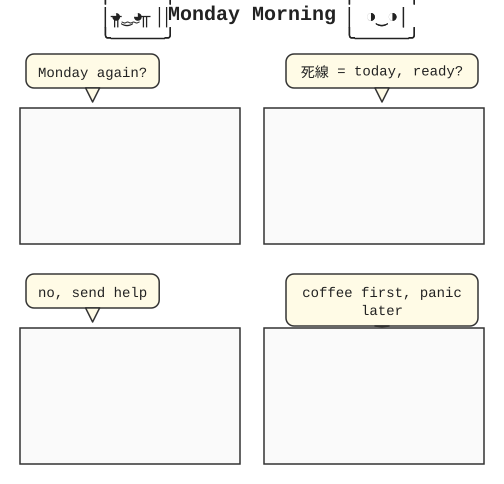

# ascii-art-comics

Generate comics as **SVG** (default) or **ASCII** (legacy). CJK + English safe, alignment guaranteed by the rasterizer, not the LLM.

## Sample comic

Rendered from `assets/examples/fixtures/monday-morning-comic.json` (4 panels, 2 chibi speakers alternating left/right, mixed CJK+EN dialogue bubbles, pure SVG primitives — no box-drawing chars).



Two chibis. Monday. A deadline. Coffee. The full pipeline — content → render — produces this in one pass, no LLM in the output path, no `║` borders, no monospace text alignment guesswork.

## Why SVG, not ASCII

LLMs have structural spatial blindness (tokenization, self-attention, VITC benchmark — see `references/llm-spatial-blindness.md`). Asking an LLM to "fix" ASCII art alignment produces the same artifacts it would create. SVG solves this deterministically: `<text>` with `font-family="monospace"` + `textLength` + `lengthAdjust="spacingAndGlyphs"` makes the rasterizer handle width and alignment. No `string-width` math at render time. No LLM.

ASCII output is kept as a legacy option for terminal users (paste-into-markdown, plain-text logs).

## Pipeline

```
content (json) → render (svg or ascii) → emit
```

| Stage | Implementation | Deterministic? |
|---|---|---|
| Content | `assets/components.json` + `assets/faces.json` | Manual / LLM-authored |
| Render SVG | `scripts/comic-render.mjs` (panels) + `scripts/bubble-render.mjs` (bubbles) | Yes |
| Render ASCII | `scripts/box-wrap.mjs` | Yes |

No LLM in the render path. No "visual audit" stage. The math is done by the rasterizer.

## Render modes

```bash
# SVG (default)
node scripts/svg-render.mjs < request.json > comic.svg
node scripts/bubble-render.mjs < bubbles.json > bubbles.svg
node scripts/comic-render.mjs < comic.json > full.svg   # panels + bubbles + title

# ASCII (legacy)
node scripts/box-wrap.mjs < request.json
```

## Tests

```bash
npm test
```

31/31 pass:
- 11 unit tests (Stage 1 content validation, Stage 2 wrap, seam contracts)
- 5 panel fixtures (ASCII)
- 4 panel fixtures (SVG)
- 1 bubble fixture (SVG)
- 1 comic fixture (panels + bubbles + title, SVG)
- 4 SVG fixture renders
- 5 component library validators

## Structure

```
SKILL.md                          # entry point
references/
  persona.md                      # 12 hard rules (no Stage 3)
  panels.md                       # box math, border sets
  dialogue.md                     # wrap per language
  validation.md                   # seam contracts
  debugging.md                    # width + alignment debugging
  llm-spatial-blindness.md        # why SVG, not ASCII
  styles/                         # A.kaomoji, B.manga, C.noir
agents/                           # content-generator, box-wrapper, box-auditor (legacy spec)
assets/
  faces.json                      # kaomoji + chibi center/left/right
  components.json                 # 96 components, 8 categories
  components-src/                 # source for build-library.mjs
  components-renders/             # visual reports
  examples/
    fixtures/                     # request JSON files
    fixtures/renders/             # ASCII outputs
    fixtures/renders-svg/         # SVG outputs
    comics/                       # end-to-end comic SVGs
scripts/
  comic-render.mjs                # panels + bubbles + title
  bubble-render.mjs               # speech bubbles
  svg-render.mjs                  # panel boxes (SVG)
  box-wrap.mjs                    # panel boxes (ASCII, legacy)
  build-library.mjs               # build components.json
  content-generator.mjs           # Stage 1 validator
  render-*.py                     # fixture runners
  test.sh                         # full test suite
```

## Component library

96 components across 8 categories: face, body, gesture, prop, scene, frame, separator, bubble. Kaomoji, chibi (center/left/right), stick figures, props, scene elements. Build:

```bash
npm run build:library              # rebuild components.json
python3 scripts/render-components.py    # visual report
python3 scripts/render-components-svg.mjs  # SVG showcase
```

## Authoring a comic

1. Define panels in JSON: `style`, `width`, `lines`, panelId
2. Add `dialogue` array: bubble position, text, tail direction (relative to each panel)
3. Set `layout.cols` for grid (0 = stack, n = n columns)
4. `node scripts/comic-render.mjs < comic.json > comic.svg`

See `assets/examples/fixtures/monday-morning-comic.json` for the full example.

## Key constraints

- Width math at render time: rasterizer, not script
- Border sets A (heavy) / B (light) / C (ASCII) — one per panel
- Chibi faces: 3 orientations (center / left / right) for directionality
- Mixed CJK + EN: handled by monospace + textLength
